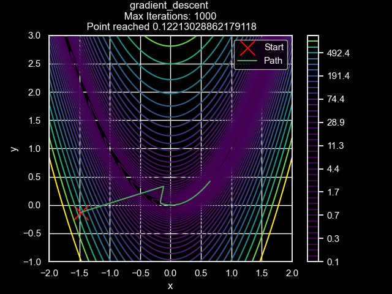
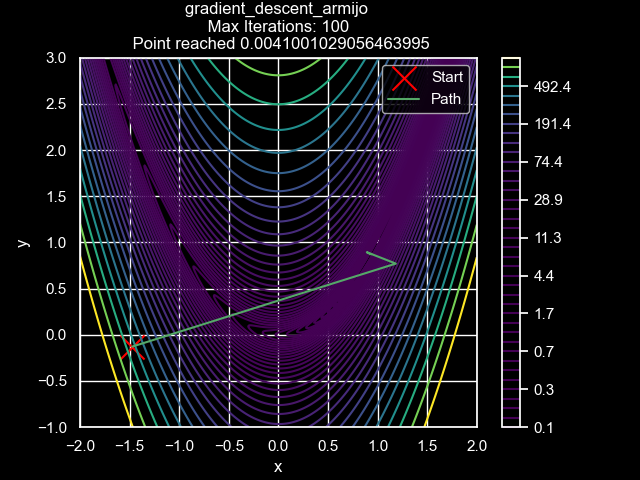
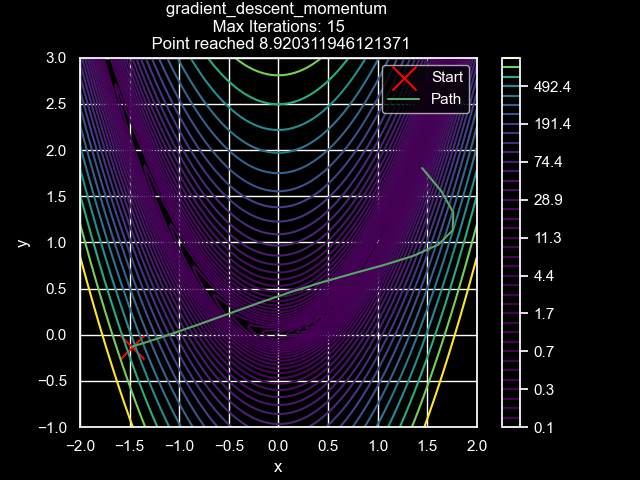
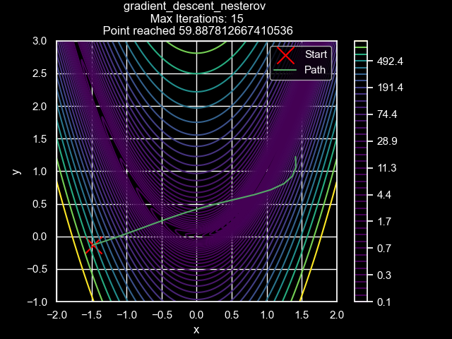
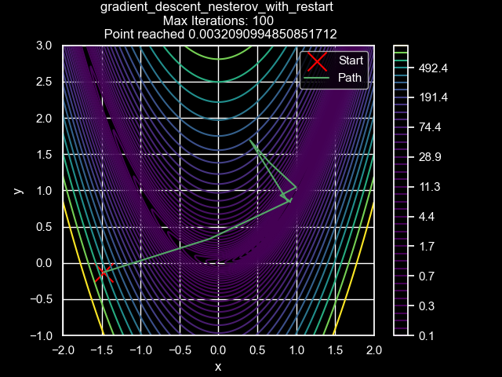
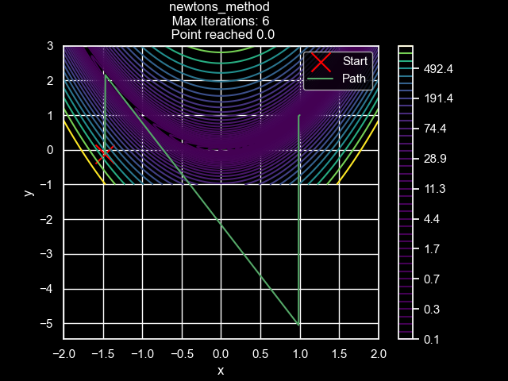
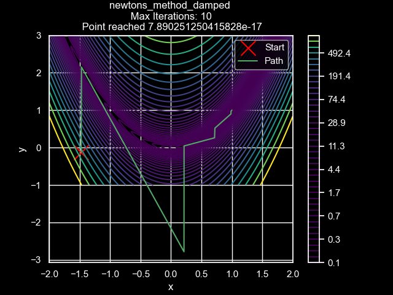
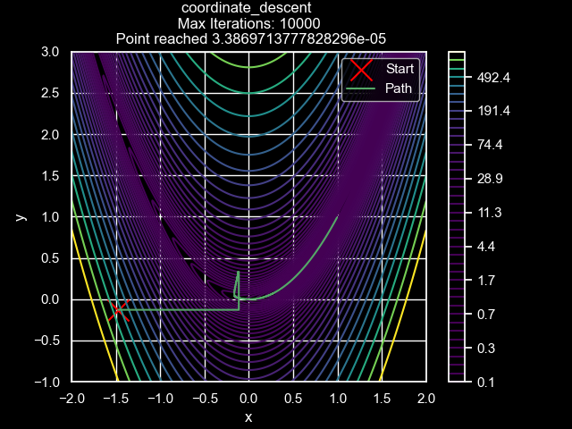

# Optimization Demo

Various optimization algorithms are shown on the **Rosenbrock function.**

Gradient descent is a baseline here in 1000 generations it minimized the objective function, but did not reach the minima.

Backtracking was able to go further than vanilla gradient descent in fewer iterations adjusting the learning rate until a progress condition as met.

## Gradient Descent with Momentum

Momentum is shown to use very few iterations compared to gradient descent with and without backtracking, but has a tendency to overshoot the minima as it considers previous parameter values to accelerate optimization.

## Gradient Descent with Nesterov Acceleration

Nesterov Acceleration is more natural and does not tend to shoot the minimum while taking into consideration previous parameters and providing an accelerated convergence rate.

## Nesterov With Restart

Restarts are used in Nesterov acceleration "course correct" the optimization path. This gives similar results to gradient descent with backtracking in fewer iterations.

## Newton's Method

Newton's method chooses the step size by using the Hessian of the objective function. It is very iteration efficient on this function and reaches the minimum in just six iterations However, the Hessian is expensive to calculate. The part here is a bit erratic to deal with this with damp the Newton update.

## Damped Newton's Method

Damping the Newton update with even 0.999 $(0.999 \times \text{the original update})$ helps a lot in making the optimization more stable. But here it took more iterations to converge.

## Coordinate Descent

Coordinate descent optimizes on one variable at a time, and this can be clearly seen by the nature of the optimization path. In this case, coordinate descent, took quite a few iterations to reach the minima.
