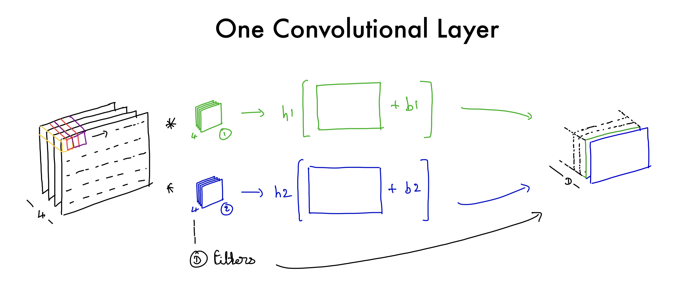
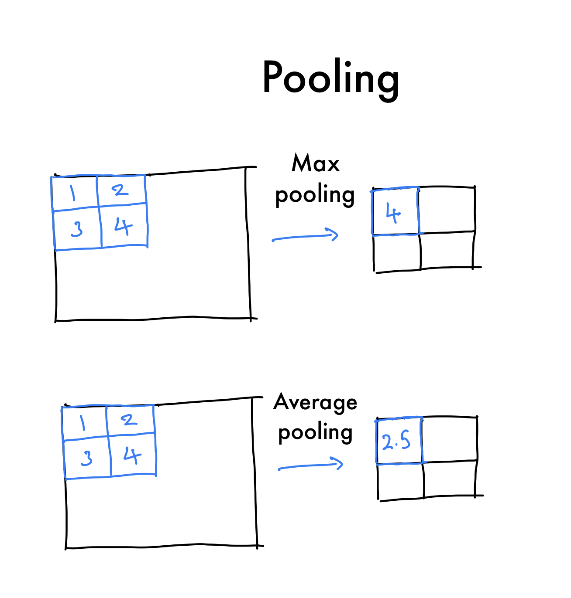
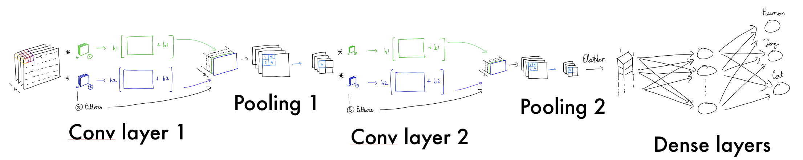
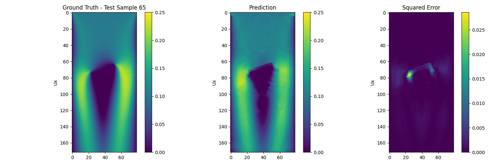

# Connvolutional Neural Networks

## Basics

Basic neural networks take and perform a linear transformation followed by a non-linear function.

$$
z = h(Wx + b)\\
\text{For single hidden layer network with } W \text{ being a learnable matrix and } b \text{ a learnable vector.}
$$

These layers can be stacked together to for a larger network which consists of "dense" or fully connected linear layers that pass through a non-linear "activation" function before moving onto the next layer.

$$
y = h_3(W_3 \cdot (h_2(W_2 \cdot h_1(W_1 x + b+1) + b_2)) + b)\\
\text{This network has 3 hidden layers.}
$$

As the data comes in it is mapped to space where it is more linearly separable. The mapping is learned from the data using backpropagation and variations of gradient descent.

**Need for convolutional neural networks?**

The issue with dense networks is the number of parameters and sizes of inputs quickly gets out of hand. A tiny $100 \times 100$ gray image has $10,000$ parameters. Assuming the output is predicting what number a picture of a digit is, the size of the output layer is 10 (0 - 9 digits). This yields a network with at least $10,000 \times 10 = 100, 000$ parameters. This is huge for an impractically small image size and modern networks have output sizes of in the tens if not hundreds of thousands.

The second issue is if you feed a picture into a dense neural network, you would have to flatten the image's $n$-dimensional array. So a $100 \times 100$ image matrix becomes a $10,000$ sized vector. This leads to a total loss of structure in an image which means we completely ignore the spatial locality that helps us identify what a picture contains. For example, a picture of an apple is likely to have a specific curvature. 

We need a way to reduce the size of the input leading to a reduced set of parameters. And we need a way to learn spacial localities from data. That is where convolutional neural networks come into play.

## Convolutions 

Assume discrete data with a height and width, like a gray image. A convolution can be mathematically expressed as:

$$
(I * K)(i, j) = \sum_{m=-k}^{k} \sum_{n=-k}^{k} I(i-m, j-n) \cdot K(m, n)\\
\text{Where } I \text{ is the image.}\\
\text{And } K \text{ is a relatively tiny matrix called a kernel or a filter.}
$$

Intuitively, this operation slides a tiny matrix over the image and computes a dot product at each stage. This changes the image and highlights things tat resemble the kernel. You can pass the convolved image through a non linear function $h$ to produce more complex patterns. 

Convolutions help capture spacial localities from data. This is especially useful in images to learn underlying patterns. But, convolutions are helpful in all kinds of data gain meaning from "what is around" features in the data. For example, speech data, flow fields and signals. This notion is useful in neural networks and can be found in convolutional layers.

## Convolutional Layers

Convolutional layers allow neural networks to learn spatial localities in data for example the flow of fluid or features in an image. Convolutional filters are randomly initialized before training and learn to highlight certain teaches from the data. They can drastically reduce the number of parameters needed in a network.

Filters are typically the same depth as the impact that they receive once the filter has been convolved over the image. a bias is added, and the whole thing is passed through a non-linearity assuming you use D filters you will get an output of depth D for that particular layer. 

In the above picture, the large image with depth 4 it convolved with two small filters also of depth 4. Then bias is added to each output and fed through a non-linear function. The output will be of depth 2.

The size of an image after a convolution of course depends on the stride (how many pixels you skip while you slide over) and the padding (how you deal with the boundary).

## Pooling layers

{width=50% height=50%}

Pooling layers are **do not include learnable parameters**. They are used to reduce the height and width of your data as well as build invariances from data that help in generalization and making the model more robust. There are two types of pooling - **max** pooling and **average** pooling.

Pooling is done using a $k \times k$ filter that is slid over the image and either the **maximum** or **average** value of numbers in the kernel is kept thereby reducing the size of the data passing through the pooling layer. These layers are typically placed after convolutional layers.

## Example

Below is an example convolutional neural network with two convolutional layers and two linear layers:

$$
I_1(c_1, i, j) = h_{conv_1}\left[\sum_{c=1}^{3} \sum_{m=-k_1}^{k_1} \sum_{n=-k_1}^{k_1} I(c, i-m, j-n) \cdot K_1(c_1, c, m, n) + b_{conv_1}\right] \\\\
\quad \\
P_1(c_1, i, j) = \max_{m,n \in \{0, \ldots, p_1-1\}} I_1(c_1, i \cdot p_1 + m, j \cdot p_1 + n) \\\\
\quad \\
I_2(c_2, i, j) = h_{conv_2}\left[\sum_{c_1=1}^{C_1} \sum_{m=-k_2}^{k_2} \sum_{n=-k_2}^{k_2} P_1(c_1, i-m, j-n) \cdot K_2(c_2, c_1, m, n)+ b_{conv_2}\right] \\\\
\quad \\
P_2(c_2, i, j) = \max_{m,n \in \{0, \ldots, p_2-1\}} I_2(c_2, i \cdot p_2 + m, j \cdot p_2 + n) \\\\
\quad \\
f = \text{flatten}(P_2) \\\\
\quad \\
z_1 = h_1(W_1 f + b_1) \\\\
\quad \\
Y = h_2(W_2 z_1 + b_2) \\\\
$$

## Conclusion

Convolutional layers allow us to extract features from our input in hierarchical way. Let us see we are training a CNN predict if an image is a human, dog or cat using say 3 convolutional layers followed by some fully connected layers where the output is three neurons. 

The first convolutional layer might have a certain set of filters that detect edges and boundaries. The second convolutional might have a set of filters that detect eyes, noses, ears and hair. And the third set of filters in a convolutional layers might detect limbs and appendages. At each stage some of these filters might only light up if they see, for example, see a human hand but not light up when they see a dogs paw. That condensed information is the flattened and passed through fully connected layers to finally predict what the image is.

For more information see [this](https://yosinski.com/media/papers/Yosinski__2015__ICML_DL__Understanding_Neural_Networks_Through_Deep_Visualization__.pdf) paper. 

**Fully Convolutional U-NET Type architecture**

This is a prediction (from a test set) using a simplified UNET based fully convolutional neural network.

The network takes in data from distance functions from the object and a flow region channel where each number represents information of the flow - 0 for the obstacle, 1 for the free flow region, 2 for the upper/bottom no-slip wall condition, 3 for the constant velocity inlet condition, and 4 for the zero-gradient velocity outlet condition.

