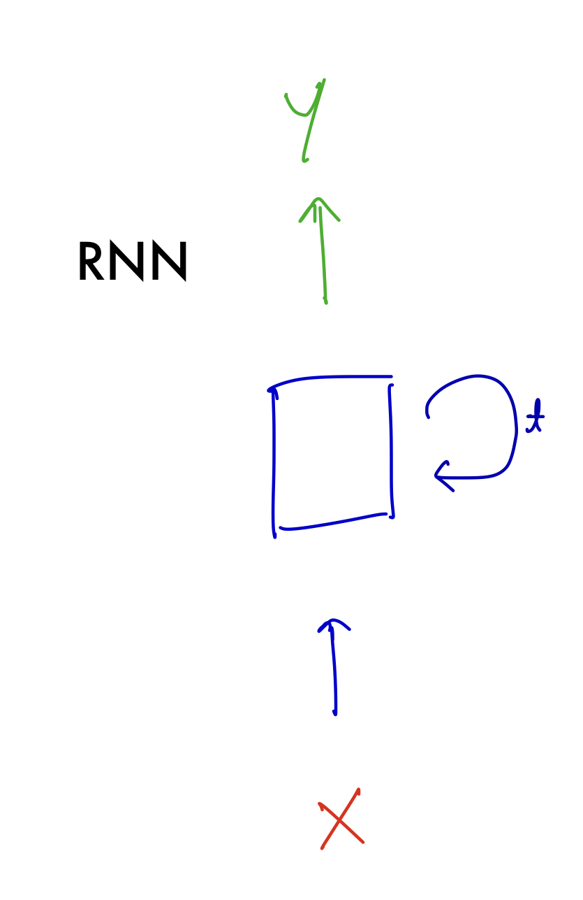
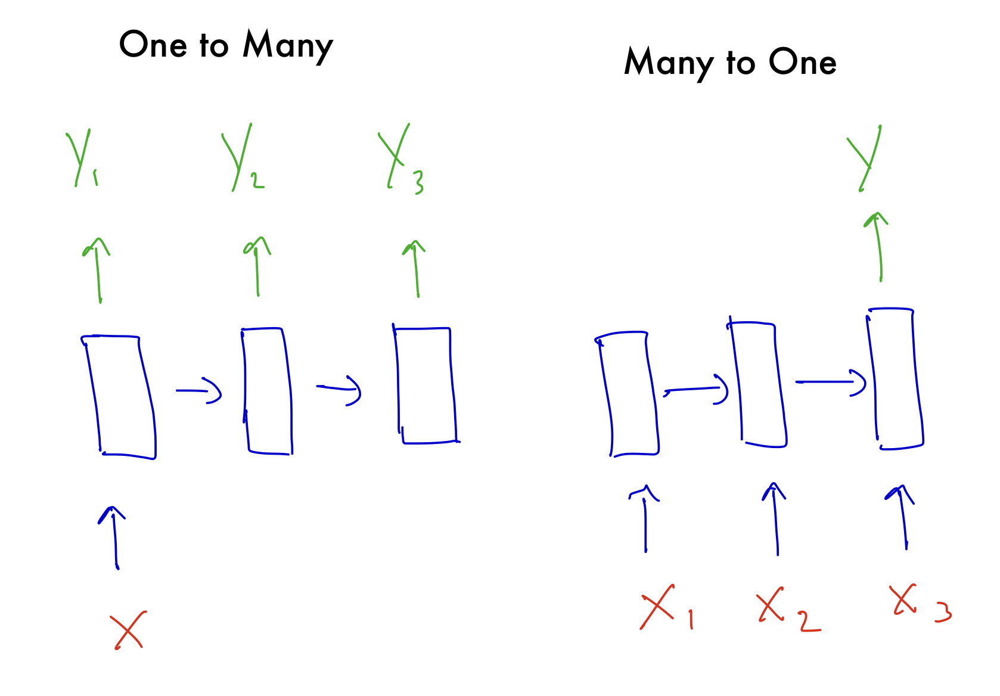
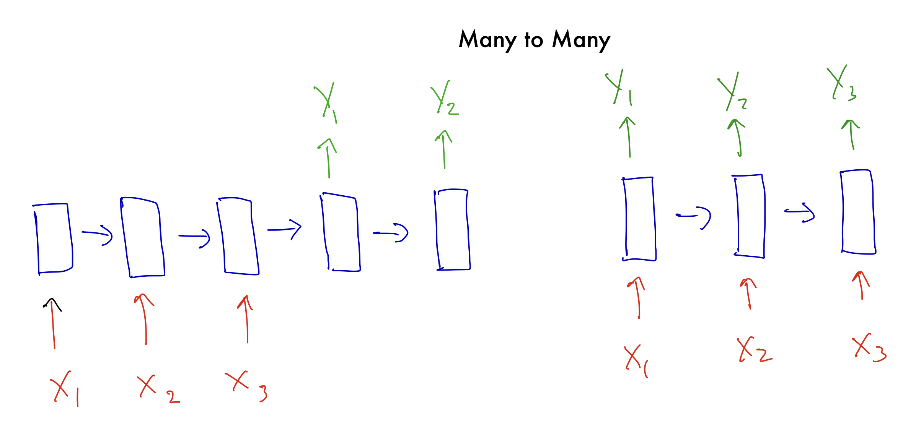
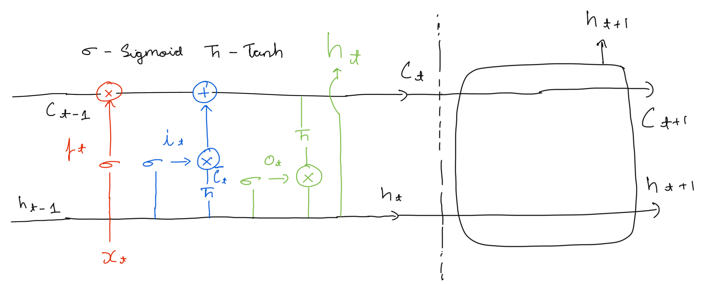

# Recurrent Neural Networks

## Background

The problem with fixed size neural networks, even with convolutional layers, is that thy cannot handle input a variable input size like a sentence with $k$ words. You could pass in one word at a time but each input will be treated independently. It is the same with images, you could pass in 10 frames of a video in a convolutional networks one after the other but there wont be any relation to the temporal component of the video. Each frame will be treated as its own separate image. This is because regular neural networks don't take into account past inputs in a sequence.

$$
y = h(Wx+b)
$$

## Introduction

To handle sequential data, we can define a neural network that updates its weights based on previous data from a sequence.

$$
h_t = f_1(W_{h} h_{t-1} + W_{x} x_{t} + b_h) \\
y = f_2(W_{y} h_{t} + b_y)
$$

Here, $W_{x} x_{t}$ is the standard matrix multiply used in regular neural networks. $W_hh_{t-1}$ relates the inputs in a sequence together. $W_{h}, W_{x}, W_{h}, b_h, b_y$ are shared across the temporal time component $t$. For each time-step $t$, a new $h$ and $y$ is calculated. $x_0$ is usually initialized to the $0$ vector or randomly. The intuition here is that the weights are updated taking into account the whole sequence.

## Types of RNN's

RNN's can be represented as -

{width=30% height=30%}

The cyclic arrow represents the network updating at a time interval $t$. This can be used to represent any recurrent neural network but we can be more concrete. There a some common arrangements that can be useful in different situations. 

### One to Many

These networks take in one input (a sequence of size 1), and produce of sequence of any size. For example, the input may be an image of fixed size and the output is a caption sequence of any size.

### Many to One 

These networks take in an input sequence of variable size and give us one output. For example, the input may be a sentence sequence of variable size and the output is the sentiment of the sentence.

### Many to Many

Here, the input and output have a variable sequence length. For example, using deep learning to translate from one language to another. We could also have a video with multiple frame and we can do segmentation or classification or segmentation over frames of the image.

## Problems with (Basic) RNN's

We do backpropagation on the "unrolled" RNN. But when we do this we run into problems as the gradient passes through this unrolled network. More concretely: 

Let us consider 3 iterations of $h_t$
$$
h1 = g(W_hh0 + W_xx1) \\
h2 = g(W_hh1 + W_xx2) \\
h3 = g(W_hh2 + W_xx3) \\
$$
Let $L$ be a loss function 

$$
\frac{\partial L_{}}{\partial W_{h}} =
\frac{\partial L_{}}{\partial h_{3}} \frac{\partial h_{3}}{\partial W_{h}} +
\frac{\partial L_{}}{\partial h_{3}} \frac{\partial h_{3}}{\partial h_{2}} \frac{\partial h_{2}}{\partial W_{h}} +
\frac{\partial L_{}}{\partial h_{3}} \frac{\partial h_{3}}{\partial h_{2}} \frac{\partial h_{2}}{\partial h_{1}} \frac{\partial h_{1}}{\partial W_{h}}\\
\phantom{1}\\
\frac{\partial L}{\partial W_{h}} = \frac{1}{n} \sum_{t=1}^{n} \frac{\partial L_{t}}{\partial h_{t}} \prod_{j=i+1}^t \frac{\partial h_{j}}{\partial h_{j-1}} \frac{\partial h_{i}}{\partial W_{h}}
$$

If the gradients are consistently more than 1, the gradient is multiplied $t$ times and explodes resulting in a overflow. If the gradients are consistently less than 1, the gradient is multiplied $t$ times and vanishes resulting in a underflow.

**We can deal with these issues by architectures that are more robust to the Exploding/Vanishing gradient problem.**

## LSTM - Long Short Term Memory

LSTM's have a channel for information to flow for the entire recurrent network giving it a long term memory. This information can only be modified very carefully through a series of gates. This is called the cell state. $C_t$ represents the cell state at a time interval $t$.

$[a, b]$ below is just a concatenation of vectors $a$ and $b$.

**Forget Gate -**

This modifies the previous state of the cell, determining now much information is retained. This is done as follows - 

$$
f_t = \sigma(W_f [h_{t-1}, x_t] + b_f)
$$
$[h_{t-1}, x_t]$ simply concats the vectors. The range of the sigmoid function $\sigma$ is $[0, 1]$. An output of 1 means that all the information is retain and 0 means "forget everything". This controls what percentage of information can influence the long term memory at $C_t$. For a language task, we can imagine forgetting predicting the end quote character **"** after we have already closed it.

**Input Gate -**

This gate adds information to the cell state as follows -

$$
i_t = \sigma(W_i [h_{t-1}, x_t] + b_i) \\
\bar{C_t} = tanh(W_C [h_{t-1}, x_t] + b_C)
$$

$\bar{C_t}$ are candidates that could be added to the cell state. The state is updated as follows - 

$$
C_t = f_t \odot C_{t-1} + i_t \odot \bar{C_t}
$$

In a language context, this would be the update of the sales state where we would loose memory of the quote character.

**Output Gate -**

This is where we get a an output for a time step $t$.

$$
o_t = \sigma(W_o [h_{t-1}, x_t] + b_o) \\
h_t = o_t \odot tanh(C_t)
$$

$h_t$ is the output at time step $t$. There are many variations on this memory architecture. 

## Gated Recurrent Units

GRUs also selectively updates and expose information over time. The architecture is simplified compared to LSTM by combining the forget and input gates into a single gate and merging the cell and hidden state.

**Update Gate -**

$$
z_t = \sigma(W_z [h_{t-1}, x_t] + b_z) 
$$

**Reset Gate -**

$$
r_t = \sigma(W_r [h_{t-1}, x_t] + b_r) 
$$

**Candidate Hidden State -**

$$ 
\bar{h}_t = \tanh(W [r_t \odot h_{t-1}, x_t] + b) 
$$
**Final Hidden State -**

$$ 
h_t = (1 - z_t) \odot h_{t-1} + z_t \odot \bar{h}_t
$$

