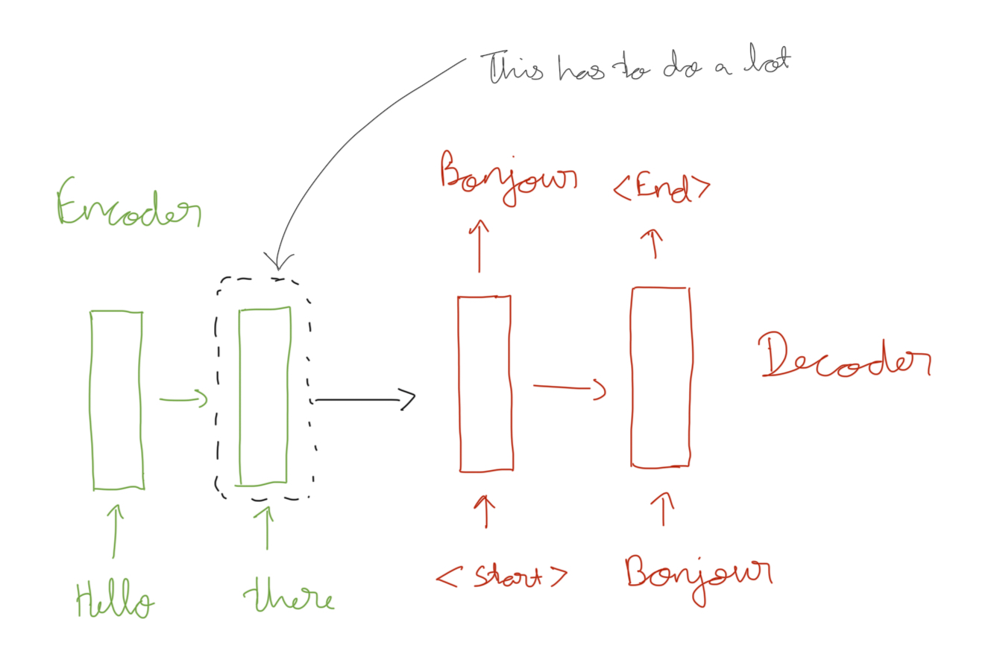
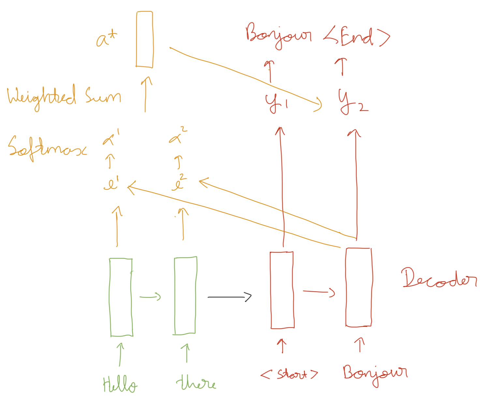

# Attention with RNN's

## Introduction

Attention is a mechanism that allows a network to focus on different parts of an input sequence. Humans give more meaning to certain parts of a sequence. For example, the information in the sentence "we have a dog, he is 5 years old" can be condensed into "have dog 5 years old". Naturally we would pay attention to these words. This is the premise behind attention. Assign a score of importance to parts of a sequence. 

Assume we have a RNN with cells that encode some information and then decode it to something else but maintain meaning. Perhaps, translating a sentence from one language to another. 

The problem here, aside from numerically unstable gradients (which LSTM's and GRU's help with) is that we are encoding a lot of information into the last hidden state of the encoder. attention is a mechanism that can help with this bottleneck.

Say we have encoder hidden states $h_1, h_2, ..., h_n$ and **one** decoder hidden states $s_t$. 

The attention scores can be calculated using a dot product (there are other methods): 

$$
e^t = [s_t^Th_1, s_t^Th_2, ... s_t^Th_n]
$$

Then, we use a softmax function to get probabilities.
$$
\alpha^t = softmax(e^t)
$$
Now to get the attention output $a^t$, we take a weighted sum.

$$
\sum_{i=1}^n = a^t h_i
$$
The final step is to concat $[a^t, s_t]$ and pass it along to the decoder.

Attention scores are (more) usually computed using a square matrix $W$. This is called bilinear or multiplicative attention. This allows any element of $s$ to be scored with any element in $h$. But, this leads to an explosion in the number of parameters. Attention between an encoder and decoder is called cross-attention.

$$
e_i = s^TWh_i 
$$
A more memory efficient way is **Reduced rank multiplicative attention**. 

$$
e_i = s^T\phantom{1}W_1^TW_2\phantom{1}h_i = (W_1s)^T (W_2h_i) \\
\text{Where } W_1, W_2 \text{ are low rank matricies.}
$$

## Pros and Cons of attention.

We calculate attention scores using learned parameters. These scores give us insight into that the model is "looking at" or what it is "paying attention" to. This provides some interpretability even for a large trillion parameter model.

Consider a bidirectional RNN where the model can "look" at $h_{t-1}$ and $h_{t+1}$ when you are $h_{t}$. Now consider a long sentence "The people went to <very long sequence> and then they <long sequence>". What "they" refers to can get "lost" even with LSTM's that propagate gradient better.

RNN's are also inherently sequential in nature. So parallization is not possible. A recent popular approach is to ditch RNN's and use transformers with attention to build a parallizable network that can keep track of very long range dependencies called Transformers.

