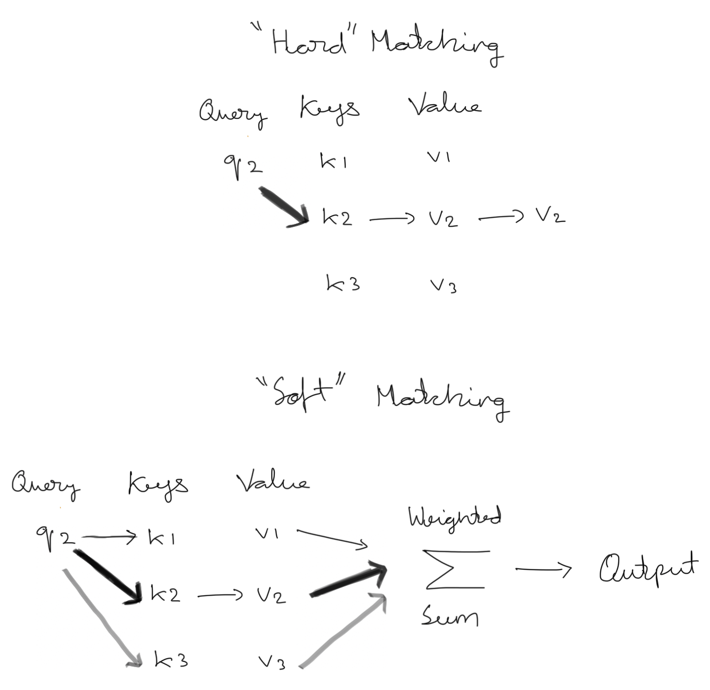
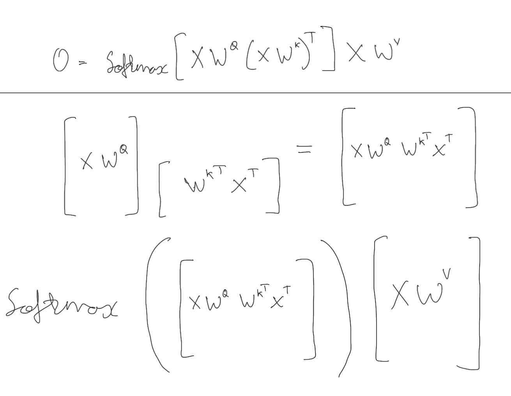
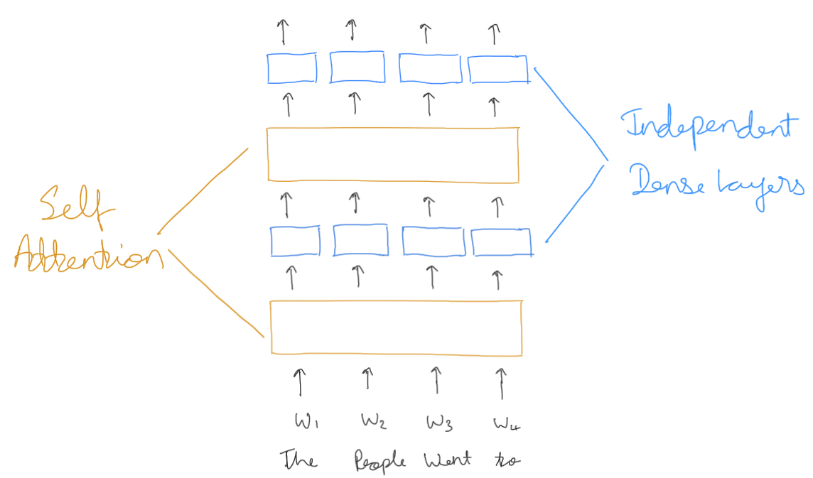
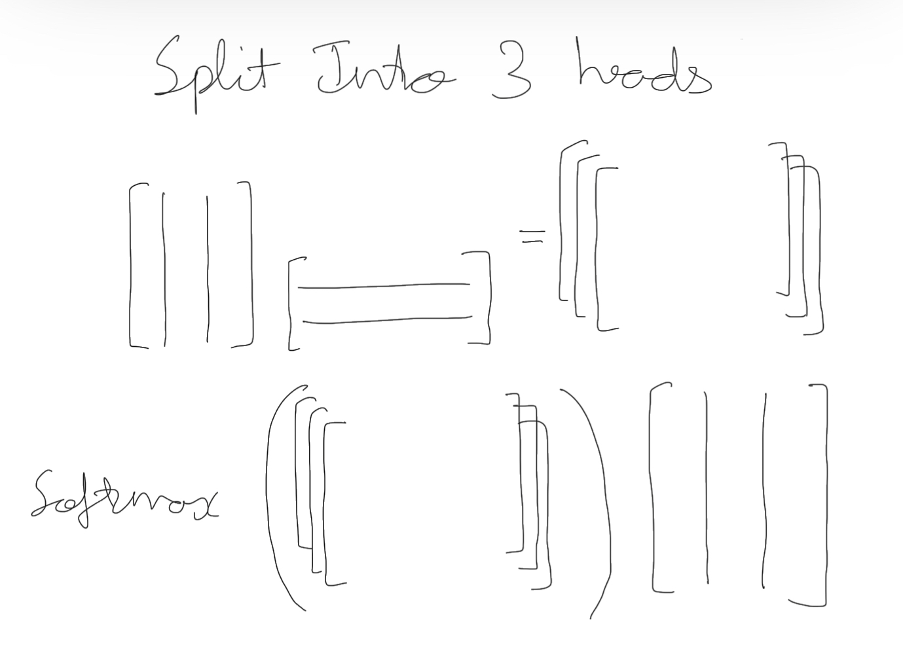
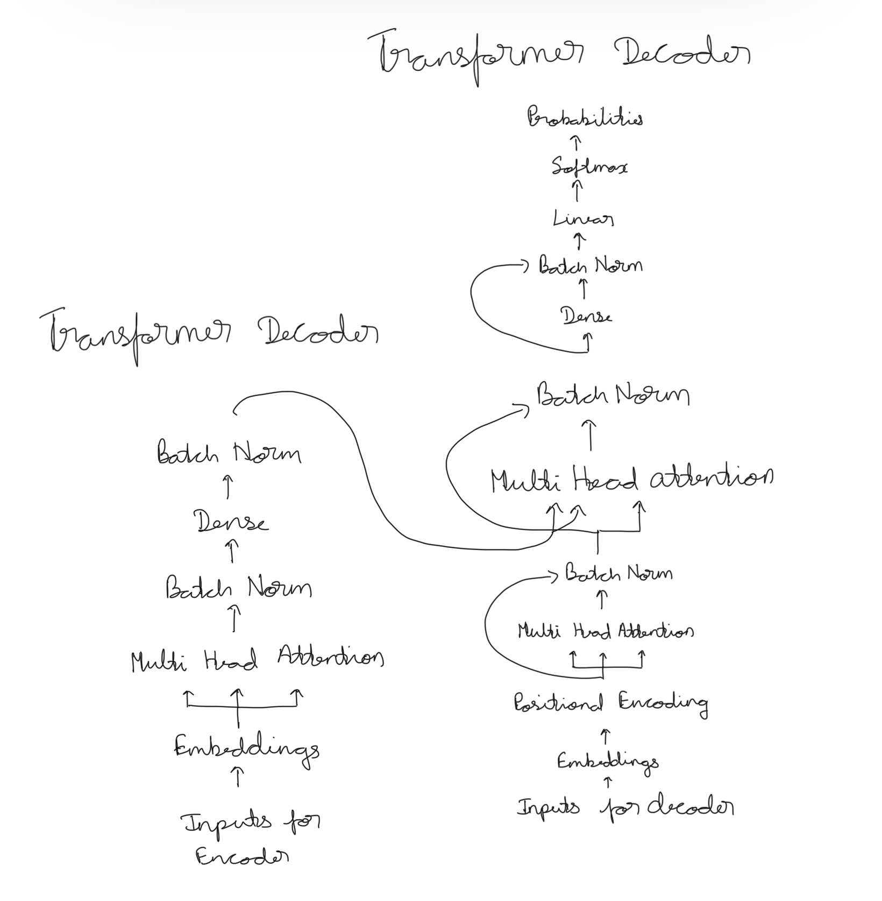

# Self-Attention and Transformers

## Self-Attention Mechanism

Consider a sequence of inputs like a sentence or a voice recording like "The people ate some food and it was good". Self attention allows a model to differentiate between what "it" refers to even in much longer sequences. In the above example, what "it" refers to can infer that the food was good or the people were good. Developing context within a sequence is important to help differentiate this. Self-attention lets you do this and the "self" refers to attention within a sentence. In a properly trained network, "it" would pay attention to "food".

Self-attention still relies on similarity scores but works a little differently. Attention can use a mechanism similar to a key-value store. But instead of finding the exact key for a query, a query can result a higher score for a key and low for others. The output would then me a weighted sum.

More concretely, it is done as follows:

This is done with matrices. Say we have $w_1, ... w_t$ words in a large vocabulary. $x_1, ... x_t$ are those words embedded into some space $x_i = Ew_i$ where $E$ is an embedding matrix.

We then transform each embedding using 3 different learnable matrices $W^K, W^Q, W^V$.

- The queries are given by $q_i = W^Qx_i$ or $Q = XW^Q$
- The keys are given by $k_i = W^Kx_i$ or $K = XW^K$
- The values are given by $v_i = W^Vx_i$ or $V = XW^V$

Now the raw attention scores are calculated using: $e_{ij} = q_i^Tk_j$ or $E = QK^T$

Now we normalize to probabilities (or interpreted like probabilities) using using the softmax function: $\alpha_ij = \frac{e^{e_{ij}}}{\sum_{ij^*} e^{ij^*}}$ or $A = softmax(E)$

Then, we compute the output as the weighted sum: $o_i = \sum_{j} \alpha_{ij} v_j$ or $O = AV$

This is done like this to be more GPU efficient manner like this - 

The freedom of the self-attention mechanism also allows for parallelization but we loose what position a vector is in a sequence. It is an operation on sets not an ordered sequence. So what is commonly used is **learned absolute position encoding**. Here we use a $n \times d \text{ matrix }P$ matrix and each column $p_i$ is the positional encoding. Then we simply let $\hat{x_i} = x_i + p_i$

Also, from the mechanism used above self-attention is just a linear transformation. In order to introduce non-linearity, we can simply add dense layers with some activation function after self-attention.

$$
m_i = Dense(o_i) = W_2 \cdot h_1 (W_1 \cdot o_i + b_1) + b_2
$$

If we are using an encoder-decoder architecture like in translation, we need to make sure that in the decoder we are only allowing the network to "see" the step you are on and not peek into the future during training. We could change the keys and queries at each time step but this is inefficient. A better way is to mask the attention.

$$
e_{ij} = \begin{cases}
q_i^Tk_j & \text{if } j \leq i \\
-\infty & \text{if } j > i
\end{cases}
$$
Note that the softamx of $-\infty$ is 0 which implies we can't "look" at it.

## Multi-Head Attention

Say we have a sequence that is split into 2 important parts - "The people went to the restaurant and ate food".

A query on "restaurant" could give high score on "ate" and "food". But it could also be contextually correct to give a high score on "people" and "went". Why not both?

We can split our attention into multiple "heads" and hope that they specialize to "catch" different things in a sequence. This is computationally very efficient since we are not adding matrices. We're just splitting the ones that we have into many heads.

**Summary**

The people went to a nice restaurant and ate good food.

Each word has its own embedding we take that embedding and map it to a lower dimensional vector using the query matrix. each word is also mapped to a lower dimensional space using the key matrix. Now if the lower dimensional vectors align. It means that we have a high score for those words, focusing on the word restaurant. It might have a higher attention score with the word nice which is describing the restaurant. This means that the embedding for the word nice attends to the embedding of the word restaurant. Softmax let us interpret this as probabilities.

Now, the value matrix takes the soft, maxed vector and moves it. In the restaurant example, it might move (update) the restaurant vector (after softmax) towards a region that align with "nice" things. Say the current attention head cannot make this update from a regular restaurant to a nice restaurant. This is why we have multiple heads of attention each of which could specialize to different tasks and help us look at different contexts of a sentence.

## Tips for numerical stability

**TODO**

**Scaled dot product**

**Skip connections**

**Batch norm**

## Transformers

Transformers rely on self attention and were introduced in the paper "Attention is all you need" by Vasvani et al. They can be summarized like this:

The arrows from the decoder to the decoder uses cross-attention. **TODO cross attention and transformer details.**

