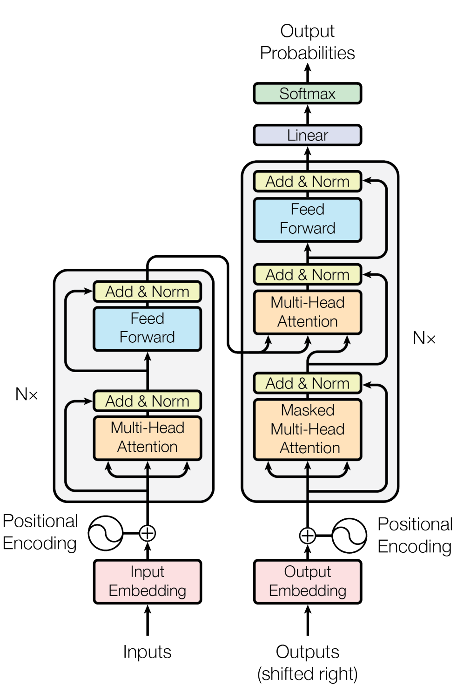

# Self-Attention and Transformers

## Self-Attention Mechanism

Consider a sequence of inputs like a sentence or a voice recording like "The people ate some food and it was good". Self attention allows a model to differentiate between what "it" refers to even in much longer sequences. In the above example, what "it" refers to can infer that the food was good or the people were good. Developing context within a sequence is important to help differentiate this. Self-attention lets you do this and the "self" refers to attention within a sentence. In a properly trained network, "it" would pay attention to "food".

Self-attention still relies on similarity scores but works a little differently. Attention can use a mechanism similar to a key-value store. But instead of finding the exact key for a query, a query can result a higher score for a key and low for others. The output would then me a weighted sum.

More concretely, it is done as follows:

This is done with matrices. Say we have $w_1, ... w_t$ words in a large vocabulary. $x_1, ... x_t$ are those words embedded into some space $x_i = Ew_i$ where $E$ is an embedding matrix.

We then transform each embedding using 3 different learnable matrices $W^K, W^Q, W^V$.

- The queries are given by $q_i = W^Qx_i$ or $Q = XW^Q$
- The keys are given by $k_i = W^Kx_i$ or $K = XW^K$
- The values are given by $v_i = W^Vx_i$ or $V = XW^V$

Now the raw attention scores are calculated using: $e_{ij} = q_i^Tk_j$ or $E = QK^T$

Now we normalize to probabilities (or interpreted like probabilities) using using the softmax function: $\alpha_ij = \frac{e^{e_{ij}}}{\sum_{ij^*} e^{ij^*}}$ or $A = softmax(E)$

Then, we compute the output as the weighted sum: $o_i = \sum_{j} \alpha_{ij} v_j$ or $O = AW^V$

This is done like this to be more GPU efficient manner like this - 

The freedom of the self-attention mechanism also allows for parallelization but we loose what position a vector is in a sequence. It is an operation on sets not an ordered sequence. So what is commonly used is **learned absolute position encoding**. Here we use a $n \times d \text{ matrix }P$ matrix and each column $p_i$ is the positional encoding. Then we simply let $\hat{x_i} = x_i + p_i$. 

Note that we cannot simply assign inputs in a sequence a number like 1, 2, 3.. and so on for two reasons. the first one is the sequence might grow very large and the sequence number could be in the millions. The second reason is - let's say we have an input embedding for the word "cat". Right now, without any positional embedding, the vector is pointing in a certain direction. If you add a large number to it or a vector with large numbers, we might push the cat vector to the point where it no longer signifies the word "cat". We need small updates that signify the position to retain the meaning of that input. The the original paper, this positional encoding was done with sine and cosine functions but it is now more common to make it a learned position matrix.

Also, from the mechanism used above self-attention is just a linear transformation. In order to introduce non-linearity, we can simply add dense layers with some activation function after self-attention.

$$
m_i = Dense(o_i) = W_2 \cdot h_1 (W_1 \cdot o_i + b_1) + b_2
$$

If we are using an encoder-decoder architecture like in translation, we need to make sure that in the decoder we are only allowing the network to "see" the step you are on and not peek into the future during training. We could change the keys and queries at each time step but this is inefficient. A better way is to mask the attention.

$$
e_{ij} = \begin{cases}
q_i^Tk_j & \text{if } j \leq i \\
-\infty & \text{if } j > i
\end{cases}
$$
Note that the softamx of $-\infty$ is 0 which implies we can't "look" at it. This is called "Masked Attention".

## Multi-Head Attention

Say we have a sequence that is split into 2 important parts - "The people went to the restaurant and ate food".

A query on "restaurant" could give high score on "ate" and "food". But it could also be contextually correct to give a high score on "people" and "went". Why not both?

We can split our attention into multiple "heads" and hope that they specialize to "catch" different things in a sequence. This is computationally very efficient since we are not adding matrices. We're just splitting the ones that we have into many heads.

More concretely, the key, value and query matrices become $W^K_l$, $W^V_l$, $W^Q_l$ where $l = 1 \text{ to } h$ where $h$ are the heads of attention. The dimensionality of this is $d \times \frac{d}{h}$. Here $XW^Q$ is of reshaped to $n \times h \times \frac{d}{h}$.

**Summary**

Example sentence - "The people went to a nice restaurant and ate good food"

Each word has its own embedding we take that embedding and map it to a lower dimensional vector using the query matrix. each word is also mapped to a lower dimensional space using the key matrix. Now if the lower dimensional vectors align. It means that we have a high score for those words, focusing on the word restaurant. It might have a higher attention score with the word nice which is describing the restaurant. This means that the embedding for the word nice attends to the embedding of the word restaurant. Softmax let us interpret this as probabilities.

Now, the value matrix takes the soft, maxed vector and moves it. In the restaurant example, it might move (update) the restaurant vector (after softmax) towards a region that align with "nice" things. Say the current attention head cannot make this update from a regular restaurant to a nice restaurant. This is why we have multiple heads of attention each of which could specialize to different tasks and help us look at different contexts of a sentence.

## Tips for numerical stability

**Scaled dot product**

When vectors grow very large, the dot product of two vectors become very large. We need to control for this to preserve numerical stability. Instead of $O = softmax(XW^Q \phantom{1}W^{K^T} X^T) \cdot XW^V$, we do $O = softmax(\frac{XW^Q \phantom{1}W^{K^T} X^T}{\sqrt{d/h}}) \cdot XW^V$. This is coined as scaled dot product attention in the original paper.

**Skip connections**

Skip connections are used in various types of networks and are almost always useful. They help smooth out the loss landscape. They are implemented simply like this $X_i = X_{i-1} + Layer(X_{i-1})$.

**Layer normalization**

This helps enforce numerical stability after a large amount of computation. The idea is to to remove large variation in a layer before moving forward. This similar to a standard scaler in a typical ML pipeline. It is done like this - 

$$
\mu = \frac{1}{d} \sum_{i=1}^d w_i \phantom{\alpha} \text{ This is the mean.}\\
\sigma = \sqrt{\frac{1}{d} \sum_{i=1}^d (w_i - \mu)^2} \phantom{\alpha} \text{ This is the deviation.}\\
o = \frac{x - \mu}{\sigma} 
$$

Assume $w$ is a single word vector. 

## Transformers

Transformers rely on self attention and were introduced in the paper "Attention is all you need" by Vasvani et al. They can just put together based on the things we discussed earlier and multi head attention is the main idea that pulls it together.

The **Encoder** does the following:

- Inputs, which can b words.
- You embed them as a vector.
- Develop context using multi-head attention.
- Layer norm to prevent numerical instability.
- Dense layer for non-linearities.
- Layer norm again for numerical stability.

The decoder **decoder** received 2 inputs, the first one is the previous element in the sequence. The second inputs are the keys and values directly from the encoder.

Let $w_i$ be the outputs from the encoder and $z_i$ be the inputs from the decoder. Cross attention is computed as follows.

$$
\text{The key and value is calculated from the encoder.}\\
k_i = W^Kh_i \\
v_i = W^Vh_i\\
\text{The query is calculated from the decoder.}\\
q_i = W^Qz_i
$$

The decoder also follows the general theme of **embed -> attention -> normalize -> dense**. In the decoder however, a linear layer followed my the softmax function is used to get probabilities.

## Conclution and Drawbacks

Transformers have achieved state of the art of the art results in most tasks, including natural language, processing computer vision and time series modelling. They can model extremely long range dependencies and due to their very parallel nature during training, a huge amount of data can be thrown into them developing a more robust model capable of generalizing better. the downside is that transformers require a large amount of data for example, if you have less data, a convolutional neural net is likely to work better but with more data, a transformer is more likely to beat a CNN.

Another downside is that in self attention, there is a quadratic need for computation with sequence length $O(n^2 d)$. For recurrent models, it grew linearly. There are other methods that reduce the quadratic runtime, but don't scale efficiently, which is why they're not used in very large models.

