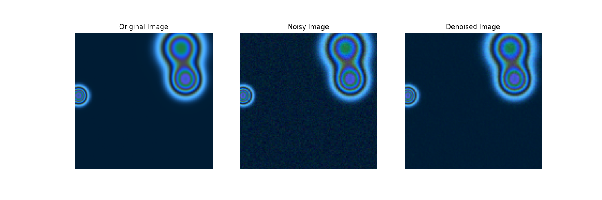
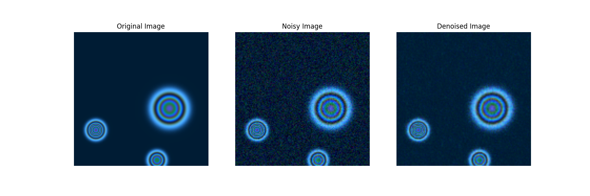
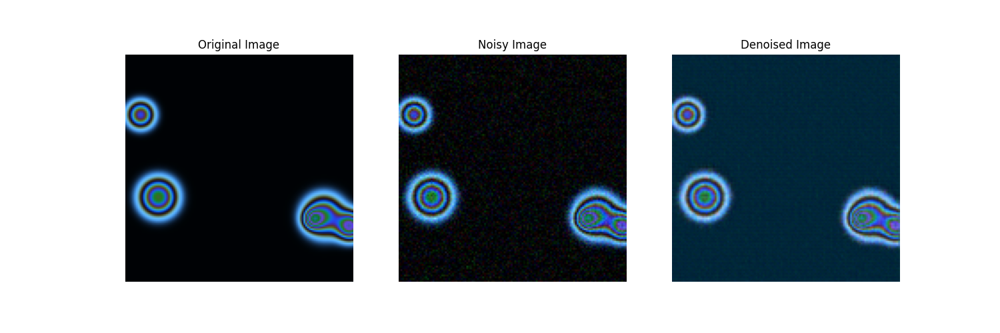
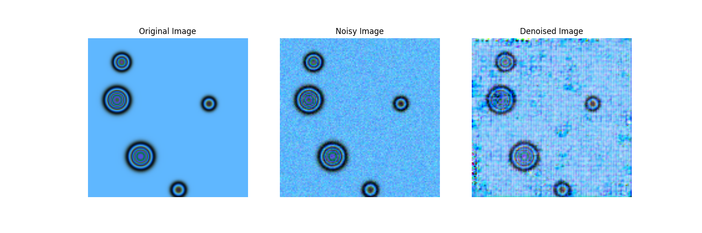

# Project

An interferometry problem consists of mapping a colour to a particular thickness. the problem is that the colour band can repeat. Two colours that look the same make her respond to two different thicknesses.

In a perfect call mapping, a particular colour respond to one thickness, but if you have some noise in the data, there is an error in what thickness a colour might be.

Using deep autoencoders offer, personalized and state of the art performance when it comes to denoising. this was an attempt to find two things - 

1. Can deep autoencoders denoise a specific color map's interferometry data?
2. Can denoising apporches trained on one color map generalize to other color maps?

The model used 3 convolutional layers, then 2 dense layers in the encoder. Then, 2 dense layers followed by 3 transposed convolutional layers. The Leaky ReLU nonlinearity and skip connections were used. Kaiming and Xavier initilizations were used. This was trained with AdamW.

The test error is a Mean Squared Error of 0.0002

**Lower Noise Level -** 

The test error is a Mean Squared Error of 0.0006

**Higher Noise Level - **

Note that while a error of magnitude $10^{-4}$ sounds low but for reference an error of magnitude $10^{-1}$ leads to unrecognizable results

With longer training and a larger model, the error is almost certainly guaranteed to go further down. Denoising autoencoders can reduce the uncertainty in the thickness mapping. 

Now for the 2nd question of generalizing to different color maps. The answer here is no. The model would have to be trained on a diverse dataset to be able to generalize to various color maps.

The model achieved a loss of 0.0176 for the following color map.

And an error of 0.0185 on the following map.

